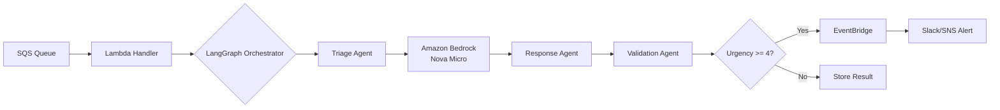

# Orion: AI Support Orchestrator (Serverless)

> Automated ticket triage system using LangGraph + Amazon Bedrock + AWS Lambda

## 🎯 Business Impact

- **80% reduction** in manual ticket classification time
- **~$0.10** to process 1,000 tickets with Nova Micro (illustrative; see Cost Analysis)
- **Sub-3 second** average response time

## 🏗️ Architecture



## 🛠️ Tech Stack

| Component | Technology | Why? |
|-----------|-----------|------|
| Orchestration | LangGraph | State management for multi-agent workflows |
| Validation | Pydantic | Type-safe data contracts (prevent hallucinations) |
| LLM | Amazon Bedrock (Nova Micro) | Low per-token cost (on-demand list defaults in code: ~$0.000035/1K in, ~$0.00014/1K out; verify [AWS Bedrock pricing](https://aws.amazon.com/bedrock/pricing/)). Anthropic Claude still supported via `BEDROCK_MODEL_ID`. |
| Infrastructure | AWS Lambda + SQS + EventBridge | Serverless, auto-scaling |
| IaC | Terraform | Reproducible infrastructure |

## 📦 Project Structure
ai-support-orchestrator/
├── infra/              # Terraform (AWS infrastructure)
├── src/
│   ├── agents/         # LangGraph workflow
│   ├── schemas/        # Pydantic data contracts
│   └── utils/          # AWS SDK helpers
├── tests/              # Unit + integration tests
└── docs/               # Architecture decisions

## 🚀 Quick Start

### Prerequisites
- Python 3.12+
- AWS Account (Free Tier eligible)
- Terraform 1.7+

### Setup
```bash
# Install dependencies
python -m venv .venv
source .venv/bin/activate
pip install -r requirements.txt

# Run tests
pytest tests/ -v

# Deploy infrastructure
./scripts/build_lambda_layer.sh   # requires Docker; builds infra/lambda_layer.zip for Python 3.12
cd infra
terraform init
terraform apply
```

**Lambda packaging:** The function zip contains only application code under `src/`. Third-party packages (LangGraph, Pydantic, etc.) live in a **Lambda layer** built by `scripts/build_lambda_layer.sh` using the **SAM Python 3.12** image so wheels match Lambda even if your laptop uses Python 3.11. Re-run the script after changing `requirements-lambda.txt`, then `terraform apply`.

Without `infra/lambda_layer.zip`, `terraform plan` / `apply` will fail on `filebase64sha256` for the layer.

## 📊 Cost Analysis

Illustrative numbers for **Nova Micro** defaults in [`src/utils/bedrock_client.py`](src/utils/bedrock_client.py) (`estimate_cost`); confirm live rates on AWS.

| Component | Free Tier | After Free Tier |
|-----------|-----------|-----------------|
| Lambda (1M requests) | $0 | $0.20 |
| SQS (1M messages) | $0 | $0.40 |
| Bedrock (~1.2M tokens, 70% in / 30% out blend) | N/A | ~$0.07 |
| **Total (1K tickets)** | **~$0** | **~$0.10** |

The ~1.2M tokens / 1K tickets assumption matches a ~1.2K token multi-agent run per ticket; your mix may differ.

## 🧪 Testing

```bash
# Unit tests
pytest tests/unit/ -v

# Integration tests (requires AWS credentials)
pytest tests/integration/ -v

# Coverage report
pytest --cov=src tests/
```

## Example outputs

Illustrative traces for documentation and debugging. Timings and token counts reflect a real run shape; ticket id is aligned with [docs/examples/sqs_lambda_event.json](docs/examples/sqs_lambda_event.json).

### CloudWatch Logs (one invocation)

Edited for readability: single `RequestId`, no duplicate console headers, no `INIT_START` noise. Example: **Billing**, **urgency 3** (below the critical threshold, so no EventBridge → SNS alert).

Tail live: `aws logs tail "/aws/lambda/$(terraform -chdir=infra output -raw lambda_function_name)" --follow`

```
START RequestId: 6b0a5ada-c74c-5713-9939-3887251c6652 Version: $LATEST
[INFO]	2026-04-18T19:48:37.617Z	6b0a5ada-c74c-5713-9939-3887251c6652	Received 1 SQS messages
[INFO]	2026-04-18T19:48:37.617Z	6b0a5ada-c74c-5713-9939-3887251c6652	Processing ticket: DEMO-README-001
[INFO]	2026-04-18T19:48:37.704Z	6b0a5ada-c74c-5713-9939-3887251c6652	Initialized Bedrock client model=amazon.nova-micro-v1:0 family=nova region=us-east-1
[INFO]	2026-04-18T19:48:37.706Z	6b0a5ada-c74c-5713-9939-3887251c6652	LangGraph workflow compiled successfully
[INFO]	2026-04-18T19:48:37.725Z	6b0a5ada-c74c-5713-9939-3887251c6652	Triaging ticket: DEMO-README-001
[INFO]	2026-04-18T19:48:38.256Z	6b0a5ada-c74c-5713-9939-3887251c6652	Bedrock (Nova) tokens: 400 in, 74 out
[INFO]	2026-04-18T19:48:38.256Z	6b0a5ada-c74c-5713-9939-3887251c6652	Triage complete: Billing (urgency 3)
[INFO]	2026-04-18T19:48:38.257Z	6b0a5ada-c74c-5713-9939-3887251c6652	Generating response for ticket: DEMO-README-001
[INFO]	2026-04-18T19:48:39.216Z	6b0a5ada-c74c-5713-9939-3887251c6652	Bedrock (Nova) tokens: 336 in, 206 out
[INFO]	2026-04-18T19:48:39.216Z	6b0a5ada-c74c-5713-9939-3887251c6652	Response generated (requires_review: True)
[INFO]	2026-04-18T19:48:39.217Z	6b0a5ada-c74c-5713-9939-3887251c6652	Validating draft response
[INFO]	2026-04-18T19:48:39.589Z	6b0a5ada-c74c-5713-9939-3887251c6652	Bedrock (Nova) tokens: 443 in, 47 out
[INFO]	2026-04-18T19:48:39.589Z	6b0a5ada-c74c-5713-9939-3887251c6652	Validation complete: PASSED (score: 9/10)
[INFO]	2026-04-18T19:48:39.590Z	6b0a5ada-c74c-5713-9939-3887251c6652	Processing complete. Tokens: 1179 in, 327 out. Cost: $0.000087
[INFO]	2026-04-18T19:48:39.592Z	6b0a5ada-c74c-5713-9939-3887251c6652	Ticket DEMO-README-001 processed: Billing (urgency 3)
END RequestId: 6b0a5ada-c74c-5713-9939-3887251c6652
REPORT RequestId: 6b0a5ada-c74c-5713-9939-3887251c6652	Duration: 1978.12 ms	Billed Duration: 3364 ms	Memory Size: 512 MB	Max Memory Used: 130 MB	Init Duration: 1385.08 ms
```

### Structured Lambda response (`aws lambda invoke`)

SQS-triggered invocations **discard** the Lambda return value on the producer side. To capture the handler’s JSON (counts, `analysis`, `cost`, `critical_alert_sent`), invoke the function with an **SQS-shaped** event.

- Sample event: [docs/examples/sqs_lambda_event.json](docs/examples/sqs_lambda_event.json)
- Illustrative **parsed** `body` (what you get after decoding the string): [docs/examples/lambda_response.sample.json](docs/examples/lambda_response.sample.json)

```bash
cd infra
aws lambda invoke \
  --function-name "$(terraform output -raw lambda_function_name)" \
  --cli-binary-format raw-in-base64-out \
  --payload file://../docs/examples/sqs_lambda_event.json \
  /tmp/lambda-out.json && python3 -m json.tool /tmp/lambda-out.json
```

The response includes `body` as a **JSON string**. Pretty-print the inner payload with:

```bash
jq -r '.body | fromjson' /tmp/lambda-out.json | jq .
```