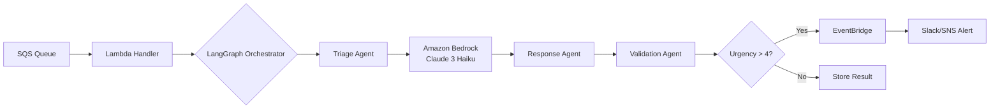

# Orion: AI Support Orchestrator (Serverless)

> Automated ticket triage system using LangGraph + Amazon Bedrock + AWS Lambda

## 🎯 Business Impact

- **80% reduction** in manual ticket classification time
- **$0.50** to process 1,000 tickets (AWS Free Tier eligible)
- **Sub-3 second** average response time

## 🏗️ Architecture



## 🛠️ Tech Stack

| Component | Technology | Why? |
|-----------|-----------|------|
| Orchestration | LangGraph | State management for multi-agent workflows |
| Validation | Pydantic | Type-safe data contracts (prevent hallucinations) |
| LLM | Amazon Bedrock (Claude 3 Haiku) | Cost-efficient ($0.00025/1K tokens) |
| Infrastructure | AWS Lambda + SQS + EventBridge | Serverless, auto-scaling |
| IaC | Terraform | Reproducible infrastructure |

## 📦 Project Structure
ai-support-orchestrator/
├── infra/              # Terraform (AWS infrastructure)
├── src/
│   ├── agents/         # LangGraph workflow
│   ├── schemas/        # Pydantic data contracts
│   └── utils/          # AWS SDK helpers
├── tests/              # Unit + integration tests
└── docs/               # Architecture decisions

## 🚀 Quick Start

### Prerequisites
- Python 3.12+
- AWS Account (Free Tier eligible)
- Terraform 1.7+

### Setup
```bash
# Install dependencies
python -m venv .venv
source .venv/bin/activate
pip install -r requirements.txt

# Run tests
pytest tests/ -v

# Deploy infrastructure
cd infra
terraform init
terraform apply
```

## 📊 Cost Analysis

| Component | Free Tier | After Free Tier |
|-----------|-----------|-----------------|
| Lambda (1M requests) | $0 | $0.20 |
| SQS (1M messages) | $0 | $0.40 |
| Bedrock (1M tokens) | N/A | $0.25 |
| **Total (1K tickets)** | **~$0** | **~$0.50** |

## 🧪 Testing

```bash
# Unit tests
pytest tests/unit/ -v

# Integration tests (requires AWS credentials)
pytest tests/integration/ -v

# Coverage report
pytest --cov=src tests/
```